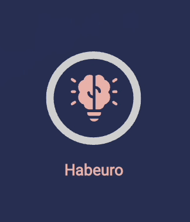
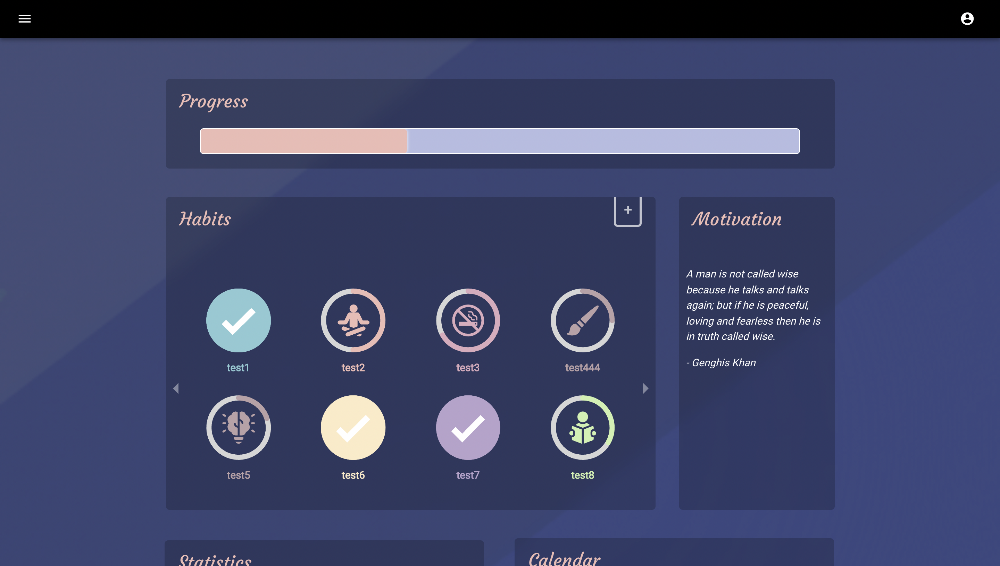
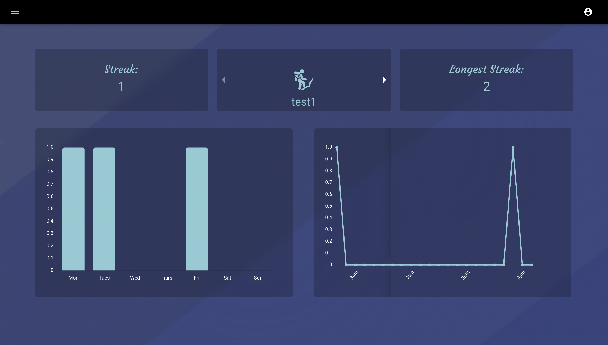
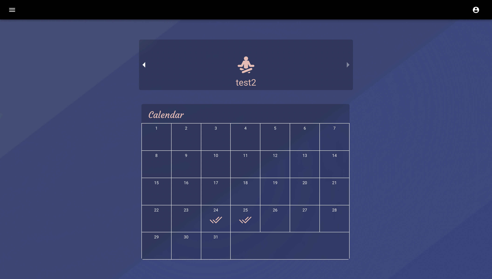

# Habeuro: habit-tracking 
<p align="center">Track habits how you want! Get back useful data!</p>
<br/>
<br/>
<p align="center" width="100%">
    
</p>
<br/>
<br/>

<p align="center">Check it out <a href="https://habeuro.com">here</a></p>


## Table of Contents
* [Introduction](#introduction)
* [Technologies Used](#technologies-used)
* [Features](#features)
* [Screenshots](#screenshots)
* [Usage](#usage)
* [Project Status](#project-status)
* [Contact](#contact)
<!-- * [License](#license) -->

---
## Introduction
- ### Problem
        Users want to build habits that can keep them productive and help them reach their ultimate goals in life.
        It's hard to actually build these habits without keeping track of them.
- ### Purpose
        The purpose of Habeuro is to give users the ability to track their habit building proccess by keeping track
        of their streaks, showing their progress, and giving them infomative data.
- ### Why 
        I chose to create Habeuro because I was always interested in becoming more productive. There are a few habit 
        trackers I tried but they didn't have the features I wanted and some were to expensive.
<!-- You don't have to answer all the questions - just the ones relevant to your project. -->

---
## Technologies Used
- React - version 17.0.2
- MongoDB - version 5.1.0
- NodeJS - version 14.16.1
- Express - version 4.17.1
---
## Features
- Habit customizability: choose which week days users want to compelete habits 
- Progress Tracking: show completion percentage of all habits
- Graphs: week days and time users complete habits the most
- Calendar: which dates habits were completed

---
## Screenshots

<p align="center" width="100%">
    
</p>
<br/>
<br/>
<br/>
<br/>

<p align="center" width="100%">
    
</p>
<br/>
<br/>
<br/>
<br/>

<p align="center" width="100%">
    
</p>
<br/>
<br/>
<br/>
<br/>


---
## Usage

```bash
# Clone this repository
$ git clone https://github.com/danteedmonson/habit-tracking.git

# Go into the repository
$ cd frontend

# Install dependencies
$ yarn 

# Run the app
$ yarn start 
```

---
## Project Status
Project is:   _complete_  


---
## Contact
Created by [@danteedmonson](https://danteedmonson.com)


<!-- Optional -->
<!-- ## License -->
<!-- This project is open source and available under the [... License](). -->

<!-- You don't have to include all sections - just the one's relevant to your project -->